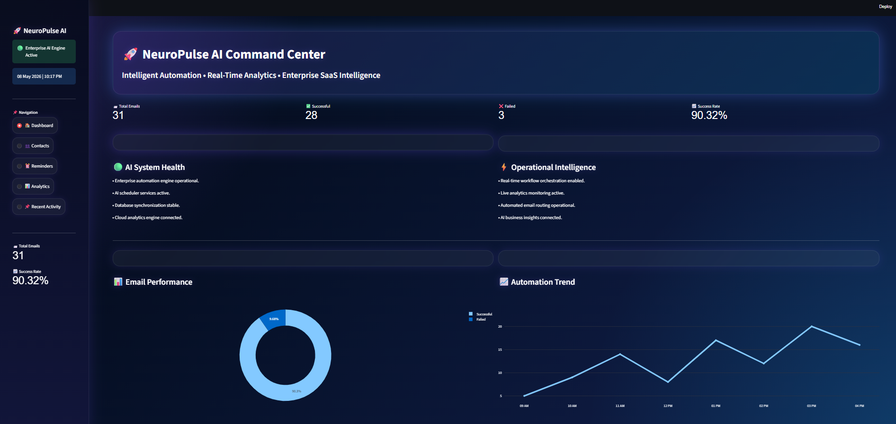
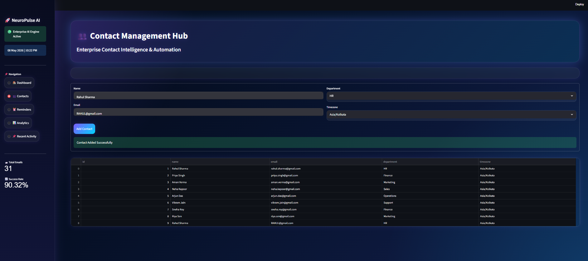
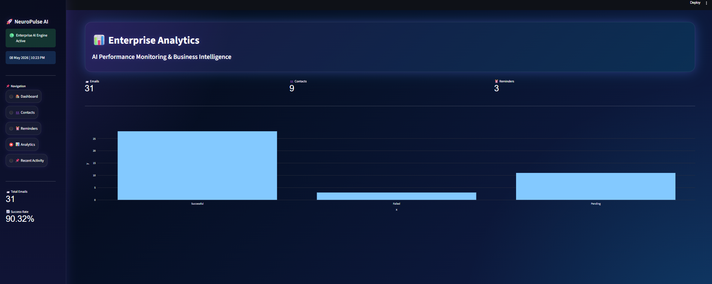
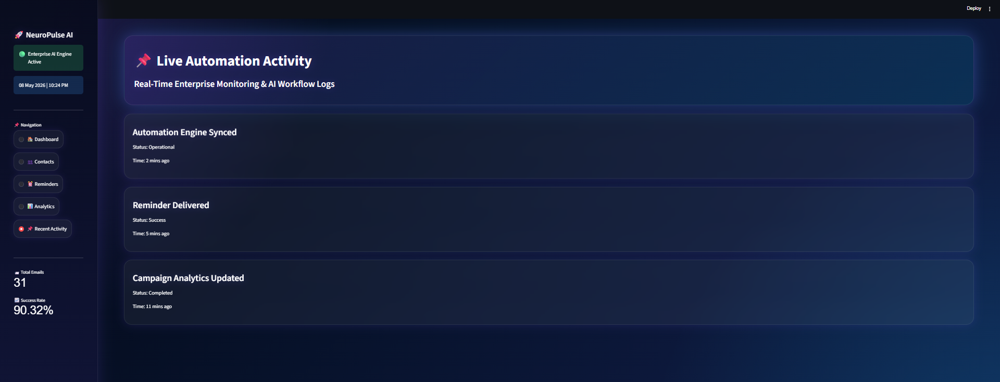
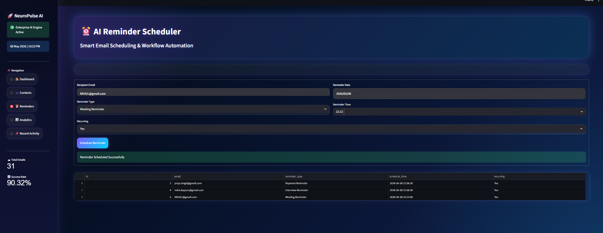
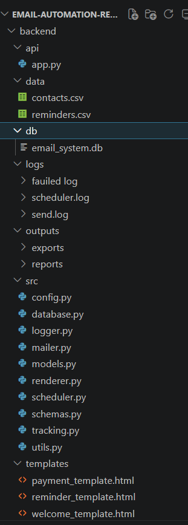

# 🚀 NeuroPulse AI — Enterprise Email Automation & Real-Time Analytics Platform

<p align="center">


</p>

---

# 🌌 Overview

NeuroPulse AI is a futuristic enterprise-grade AI-powered Email Automation & Real-Time Analytics Platform designed to simulate modern SaaS workflow orchestration systems used in real-world enterprise environments.

The platform combines intelligent automation, operational monitoring, workflow analytics, reminder scheduling, and business intelligence dashboards into a single interactive ecosystem.

Unlike basic student dashboards, NeuroPulse AI focuses on:

- 🚀 Enterprise-grade UI/UX
- 📊 Real-time analytics systems
- ⚡ Automation orchestration
- 📧 Smart workflow scheduling
- 🧠 Operational intelligence
- 👥 Contact management
- 🌐 SaaS-inspired architecture

This project demonstrates how AI automation dashboards and modern enterprise monitoring platforms work internally.

---

# ✨ Core Features

# 📧 Smart Email Automation Engine

✅ Real-time reminder scheduling  
✅ Automated workflow execution  
✅ Recurring reminder system  
✅ Task orchestration pipeline  
✅ Enterprise automation engine  

---

# 👥 Contact Management System

✅ Add & manage enterprise contacts  
✅ Department classification  
✅ Timezone-aware contact system  
✅ Dynamic workflow integration  
✅ Live operational updates  

---

# 📊 Enterprise Analytics Dashboard

✅ Real-time KPI monitoring  
✅ Workflow performance tracking  
✅ Email analytics visualization  
✅ Automation monitoring  
✅ Interactive business intelligence charts  

---

# ⚡ AI Operational Intelligence

✅ Live operational monitoring  
✅ Workflow orchestration analytics  
✅ Real-time automation tracking  
✅ SaaS-inspired dashboard ecosystem  
✅ Enterprise system intelligence  

---

# 🎨 Futuristic SaaS UI

✅ Glassmorphism design  
✅ Neon gradient effects  
✅ Animated hover interactions  
✅ Modern enterprise layout  
✅ Interactive visual analytics  
✅ Responsive dashboard system  

---

# 🧠 Tech Stack

| Technology | Purpose |
|---|---|
| Python | Core Programming |
| FastAPI | Backend API Development |
| Streamlit | Frontend Dashboard |
| SQLAlchemy | ORM Database |
| SQLite | Lightweight Database |
| APScheduler | Workflow Automation |
| Plotly | Interactive Charts |
| Pandas | Data Processing |
| Requests | API Communication |

---

# 📂 Project Structure

```bash
NeuroPulse-AI/
│
├── backend/
│   ├── main.py
│   ├── database.py
│   ├── models.py
│
├── frontend/
│   ├── assets/
│   ├── components/
│   ├── pages/
│   └── app.py
│
├── screenshots/
│   ├── dashboards.png
│   ├── contact.png
│   ├── enterprise_analysis.png
│   ├── live_automation.png
│   ├── reminder.png
│   ├── structure.png
│   └── frontend_structure.png
│
├── requirements.txt
├── run.bat
├── README.md
└── .gitignore
```

---

# 🚀 Dashboard Modules

# 🏠 Enterprise Dashboard

- AI KPI Cards
- System Health Monitoring
- Workflow Intelligence
- Automation Performance
- Interactive Analytics
- Enterprise Monitoring

---

# 👥 Contact Management Hub

- Enterprise contact system
- Department management
- Workflow integration
- Dynamic data management
- Business contact intelligence

---

# ⏰ AI Reminder Scheduler

- Smart workflow scheduling
- Reminder orchestration
- Recurring automation system
- Operational reminder engine

---

# 📊 Enterprise Analytics

- Business intelligence
- KPI monitoring
- Operational analytics
- Performance tracking
- Interactive charts

---

# 📌 Live Activity Monitoring

- Real-time logs
- Automation activity tracking
- Workflow execution monitoring
- Enterprise operational visibility

---

# 📊 Included Features

✅ Enterprise Dashboard UI  
✅ Smart Contact Management  
✅ Reminder Scheduling System  
✅ AI Workflow Automation  
✅ Real-Time Analytics  
✅ KPI Monitoring  
✅ Interactive Plotly Charts  
✅ Glassmorphism UI  
✅ Neon SaaS Design  
✅ Streamlit Frontend  
✅ FastAPI Backend  
✅ SQLAlchemy Database  
✅ APScheduler Integration  
✅ Business Intelligence System  
✅ Operational Monitoring  

---

# 📸 Screenshots

---

# 🖥️ Enterprise Dashboard



---

# 👥 Contact Management System



---

# 📊 Enterprise Analytics Dashboard



---

# ⚡ Live Automation Monitoring



---

# ⏰ AI Reminder Scheduler



---

# 🏗️ Project Structure



---

# 🧩 Frontend Architecture


---

# 📂 Frontend Modules

| Folder | Purpose |
|---|---|
| assets/ | UI assets & dashboard visuals |
| components/ | Reusable UI components |
| pages/ | Dashboard pages/modules |
| app.py | Main Streamlit dashboard |

---

# ⚙️ Installation Guide

# 1️⃣ Clone Repository

```bash
git clone https://github.com/sujalkrshaw/-NeuroPulse-AI-Enterprise-Email-Automation-Real-Time-Analytics-Platform.git
```

---

# 2️⃣ Open Project

```bash
cd -NeuroPulse-AI-Enterprise-Email-Automation-Real-Time-Analytics-Platform
```

---

# 3️⃣ Install Dependencies

```bash
pip install -r requirements.txt
```

---

# ▶️ Run Backend Server

```bash
cd backend
uvicorn main:app --reload
```

Backend runs on:

```bash
http://127.0.0.1:8000
```

---

# ▶️ Run Frontend Dashboard

Open another terminal:

```bash
cd frontend
streamlit run app.py
```

Frontend runs on:

```bash
http://localhost:8501
```

---

# 📈 Enterprise Use Cases

- Enterprise Email Automation
- AI Workflow Monitoring
- Business Intelligence Dashboards
- Operational Intelligence Systems
- SaaS Automation Platforms
- Reminder Scheduling Systems
- Enterprise Monitoring Platforms
- AI-powered Workflow Systems

---

# 🌟 Future Enhancements

# 🚀 Planned Upgrades

- SMTP Real Email Sending
- OpenAI AI Assistant
- Machine Learning Predictions
- Docker Deployment
- PostgreSQL Integration
- Authentication System
- Cloud Deployment
- Live Push Notifications
- AI Business Insights
- Advanced Workflow Engine

---

# 🧠 Why This Project Stands Out

Unlike traditional academic dashboards, NeuroPulse AI simulates:

✅ Enterprise SaaS Architecture  
✅ AI Automation Ecosystems  
✅ Real-Time Operational Monitoring  
✅ Business Intelligence Systems  
✅ Workflow Orchestration Platforms  
✅ Professional UI/UX Engineering  

This project demonstrates:

- Full Stack Development
- Dashboard Engineering
- SaaS Architecture
- Automation Systems
- Business Analytics
- API Development
- Enterprise UI Design

---

# 📢 LinkedIn Project Summary

> Built a futuristic AI-powered Enterprise Email Automation & Real-Time Analytics Platform using FastAPI, Streamlit, Plotly, SQLAlchemy, and APScheduler.

## 🚀 Key Highlights

- Enterprise-grade SaaS dashboard
- Real-time workflow automation
- Interactive operational analytics
- AI-powered monitoring system
- Smart reminder scheduling
- Business intelligence ecosystem

## 🧠 Tech Stack

Python • FastAPI • Streamlit • Plotly • SQLAlchemy • APScheduler

This project helped me explore:

- Full-stack engineering
- SaaS dashboard systems
- Automation architecture
- Business intelligence platforms
- Enterprise workflow orchestration

---

# 👨‍💻 Author

# Sujal kumar Shaw

🚀 AI & Data Science Enthusiast  
📊 Building Enterprise AI Platforms  
⚡ Passionate about Automation & Analytics  

---

# ⭐ Support

If you liked this project:

⭐ Star this repository  
🍴 Fork this project  
📢 Share on LinkedIn  

---

# 📜 License

This project is licensed under the MIT License.

---

# 🚀 NeuroPulse AI

### Intelligent Automation • Real-Time Analytics • Enterprise SaaS Intelligence
